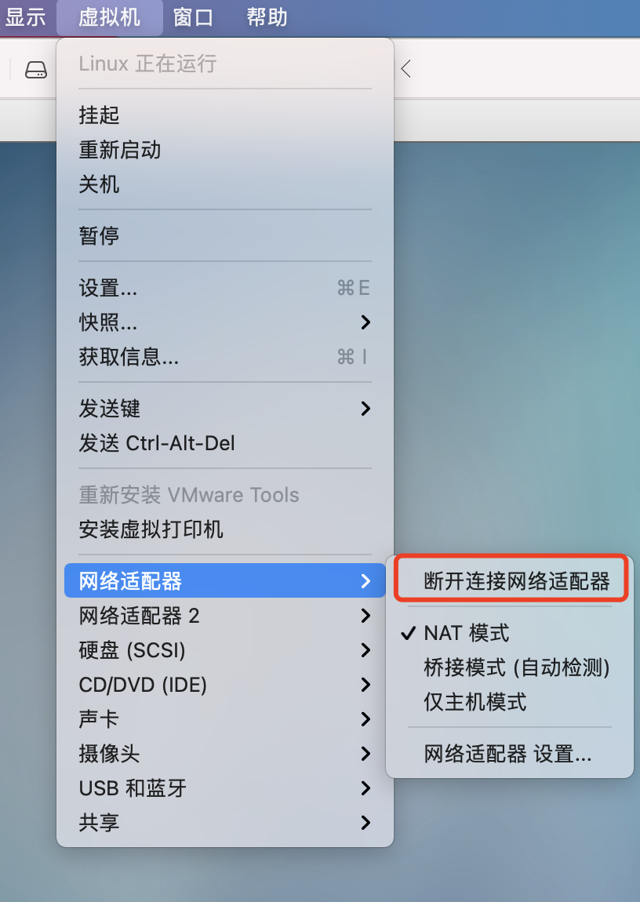
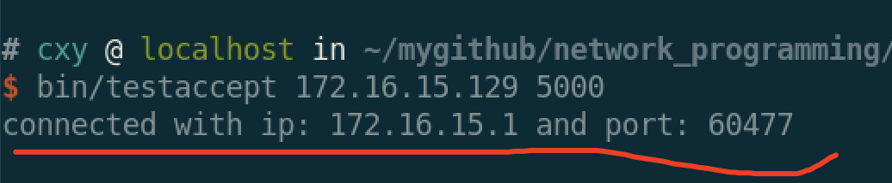
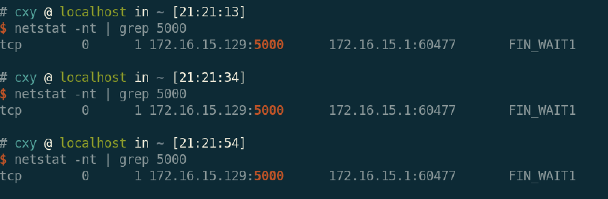
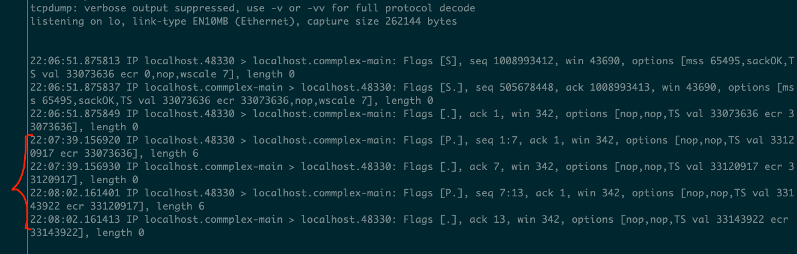

## 三次握手后，执行accept之前拔掉网线，是否能正常accept？

- 服务端在accept之前sleep一段时间
- 允许服务端
```shell
bin/testaccept 172.16.15.129 5000
```
- 客户端执行连接
```
telnet 172.16.15.129 5000
```
此时，服务端状态为 ESTABLISHED


- sleep执行完成之前，拔掉网线（因为是虚拟机，所以执行的是将网络适配器断掉）



- 服务端能够 ***正常执行appept***


- 因为代码中执行了close操作，放了FIN包，服务端进入FIN_WAIT_1状态（因为网络适配器关了，抓不到包了）。因为没法收到ack包，所以保持FIN_WAIT_1状态到结束




## 在服务端accept之前，客户端发送数据，会发生什么？
```
$ telnet 127.0.0.1 5000
Trying 127.0.0.1...
Connected to 127.0.0.1.
Escape character is '^]'.
chen
xing
```

抓包数据：



***虽然没有accept，但是客户端发送的数据服务端正常ack***