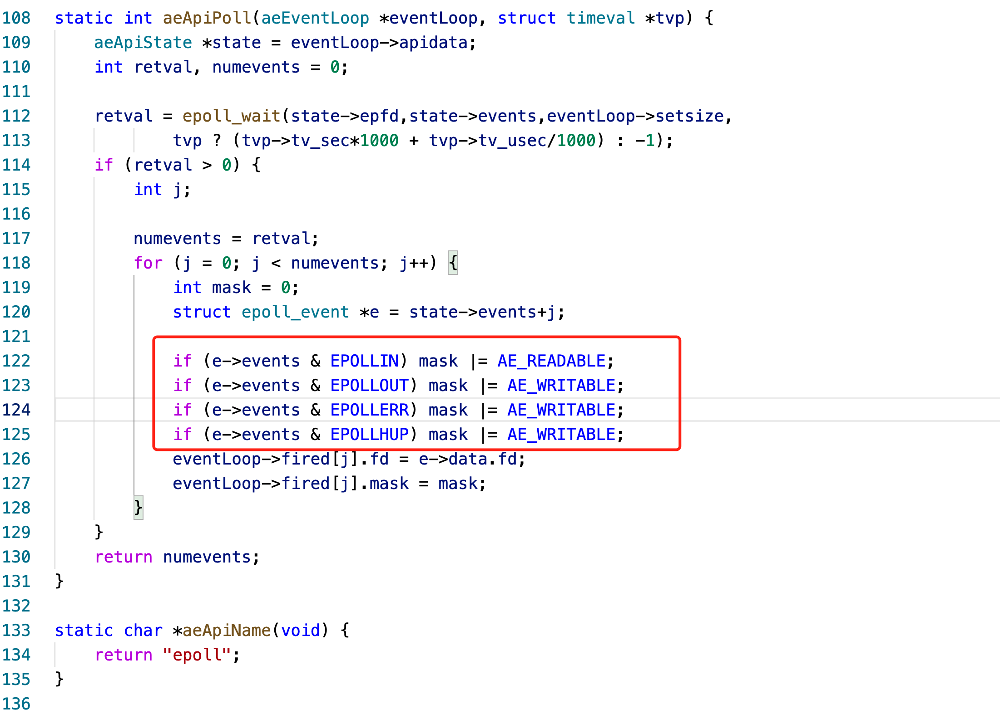
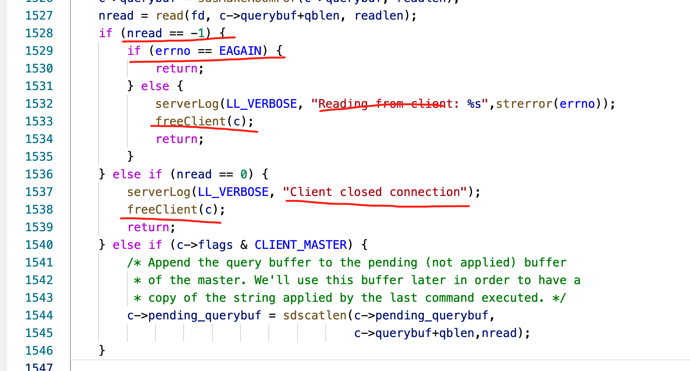
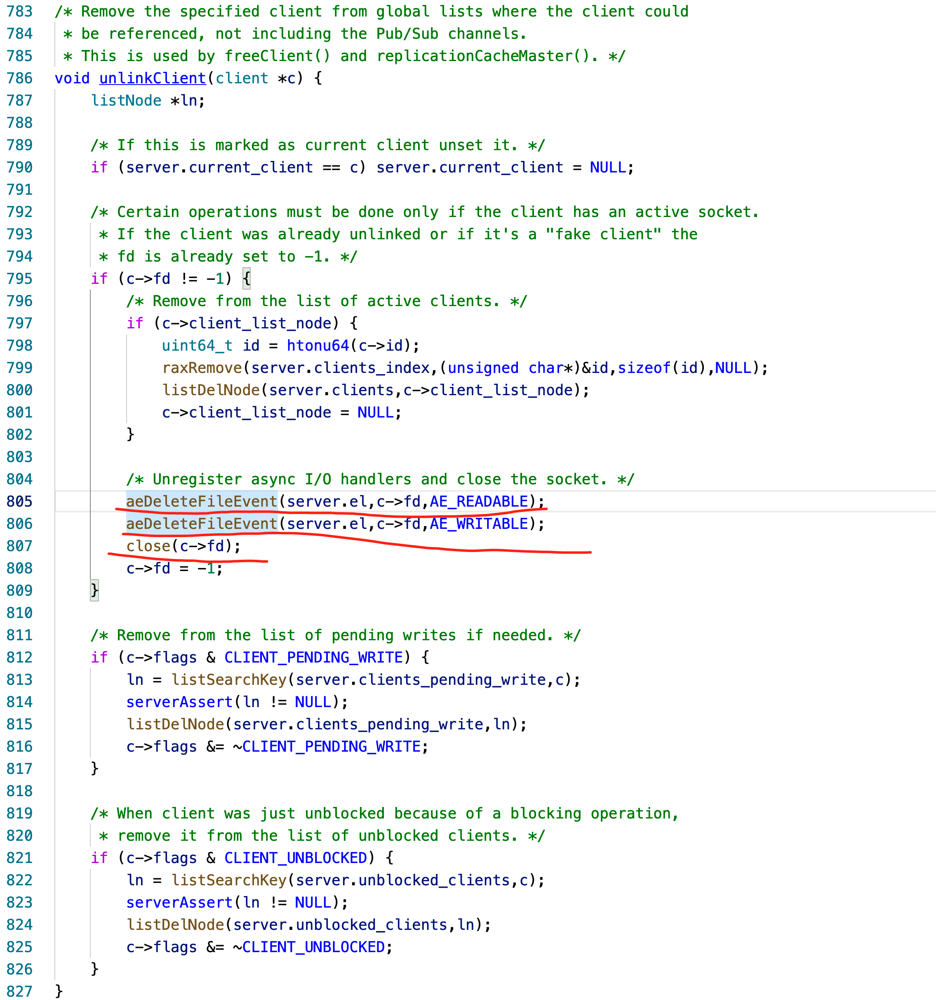

# 关键点说明

## redis-server中关注的epoll事件类型  

## redis-server中对read(我们用的recv)的处理  

- 返回值为-1时：
    - EAGAIN:不处理
    - 错误发生，关闭连接
- 返回0时
    - 客户端关闭了连接
- 返回大于0的数据时，表示正常读取

## 关闭连接的操作
- aeDeleteFileEvent中会操作从epollfd中删除
- 然后close连接

## todo:修改代码使用注册回调函数的方式