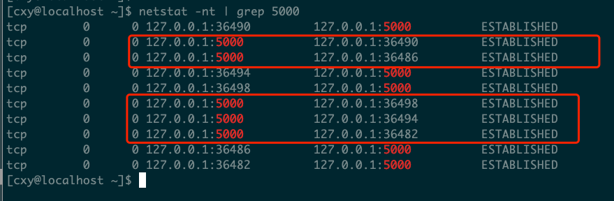
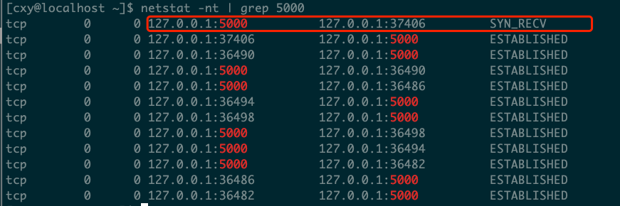

## 理解backlog

### 1.内核参数设置

将半链接队列、全连接队列设置为4，网络内核参数：<https://www.huaweicloud.com/articles/47ae78e7a6abc894c1e2f4f57cf21aee.html>

```shell
# 编辑 /etc/sysctl.conf 文件

# 表示SYN队列的长度，默认为1024，加大队列长度为8192，可以容纳更多等待连接的网络连接数。
net.ipv4.tcp_max_syn_backlog = 4
# linux中的一个kernel参数，表示socket监听（listen）的backlog上限
net.core.somaxconn = 4

# 重启生效
sysctl -p
```

### 2.模拟并观察现象 

- 编译执行程序server端程序：

```shell
gcc testlisten.c -o bin/testlisten
bin/testlisten 127.0.0.1 5000 4
```

- 客户端连接(多个客户端执行)
```shell
telnet 127.0.0.1 5000
```

- 查看状态

```shell
netstat -nt | grep 5000
```
backlog的值虽然设置的为4，但是前5个连接都是 ESTABLISHED 状态：


再继续执行的时候，服务端出现 SYN_RECV 状态：


ESTABLISHED的数量为什么是5而不是4呢？因为内核函数中是 > （大于号判断），

```
static inline bool sk_acceptq_is_full(const struct sock *sk)
{
	return sk->sk_ack_backlog > sk->sk_max_ack_backlog;
}
```

参考：<https://segmentfault.com/a/1190000019252960>

- 继续执行

- tcpdump抓包

```
sudo tcpdump -i lo port 5000
```


1. backlog的值虽然设置的为4，但是前