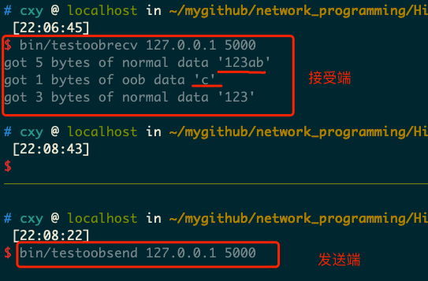
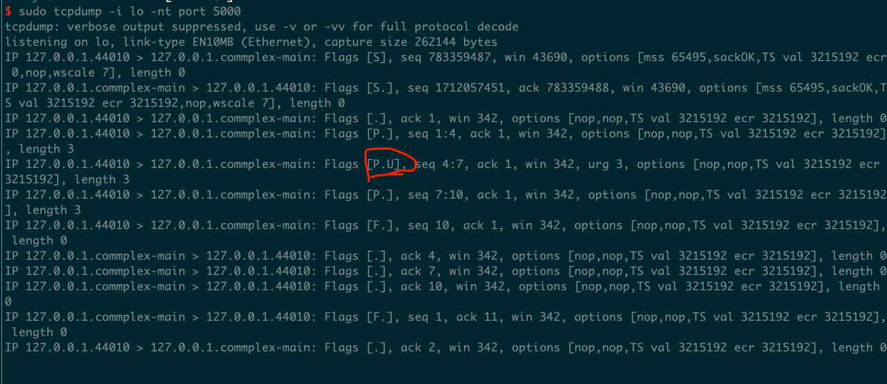

## 模拟带外数据发送
- 开3个端口执行命令

```shell
//接收端
bin/testoobrecv 127.0.0.1 5000

//发送端
bin/testoobsend 127.0.0.1 5000

//执行tcpdump
sudo tcpdump -i lo -nt port 5000
```

## 执行结果
- 接收端数据展示  

由此可见，客户端发送给服务器的3字节的带外数据"abc"中，仅有最后一个字符"c"被服务器当成真正的带外数据接收。（带外缓存只有1字节）
并且，服务器对正常数据的接收将被带外数据阶段，即前一部分正常数据"123ab"和后续的正常数据"123"是不能被一个recv调用全部读出的。

## 抓包结果

- tcpdump抓包数据，可以看到标志U，表示TCP报文段头部被设置了紧急标识。"urg 3"是紧急偏移值，它指出带外数据在字节流中的位置的下一字节位置是7（3+4，其中4是该TCP报文段的序号值相对初始序号值的偏移）。因此带外数据是字节流中的第6个字节，即字符“c”;


## 其他
内核通知应用程序带外数据到达的两种常见方式：I/O复用产生的异常事件和SIGURG信号。应用程序调用下边的函数判断下一个读取到的数据是否为带外数据：
```shell
int sockatmark(int sockfd);
```
如果返回1，使用带MSG_OOB标志的recv调用来接受带外数据。